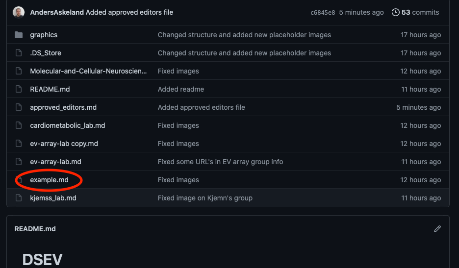
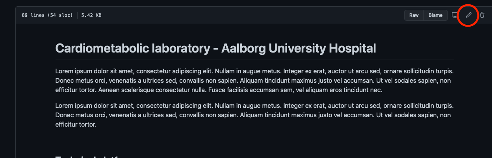
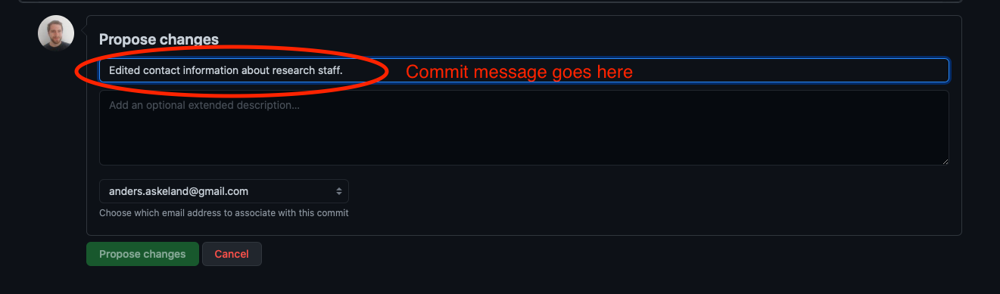

# DSEV
This repository contains information about different research groups within the field of extracellular vesicles in Denmark. The files are hosted on the DSEV (Danish Society for Extracellular Vesicles) webpage <https://dsev.dk>. 

File are written in markdown (md).

If you wish to add your own group, you must first contact DSEV using the following form: <https://www.dsev.dk/danish-ev-research-groups/#form>.

If you wish to edit information for a research group, you can submit a pull request on the specific file.

You need a github user to be able to edit or create a new group.

## How to create new group
Before you can create a new group, you'll need to contact the DSEV webpage administrator by filling out the following form: [DSEV form.](https://www.dsev.dk/danish-ev-research-groups/#form).


1. Download or clone the "example.md" file.




2. Change the file name to "my-lab.md", where "my-lab" is the name of your group/lab.
3. The file contains is build up in the following manner:
   * Comments - Several comments states how one should edit the file. Comments remain invisible when it is the file is rendered on <http://dsev.dk> and can be left in place.
        ``` md
        [//]: # (This is a comment)
        ```
    * Title and subtitles - These are prefixed by hashes (#). When editing these, do not remove the hashes, as these determine the text size.
        ``` md
        # Title
        ## Subtitle
        ### Small subtitle 
        ```
   * Editable text - Sections you should edit with the group/lab information.
        ``` md
        Lorem ipsum dolor sit amet, consectetur adipiscing elit. Nullam in augue metus. 
        ```
   * Images - Can be added for technical apparatus or research staff. Images shuld be hosted in the "graphics" folder and refered to using the absolute image address.
        ``` md
        
        ```  
   * Linebreaks - These are layout specific items. If unsure how they work, leave them be. 
        ``` md
        <br />
        ```


4. Submit the new file using a pull request or manually send it to DSEV.
    * Add file requests for new files are done by pressing "Add file -> Upload new file". 
    * Write a short description about the file
    * Upload your .md file.
    * Submit file.

The file will be reviewed by the DSEV webpage administrator before being published.


## How to edit an existing group
If you wish to edit an existing group, you must ensure that your on the list of approved editors (found in file: approved_editors.md). If you are not, the group administrator must request that you'll be added before you are allowed to edit.

1. Clone or view the group file.
2. Press the edit button.


3. Edit the file.
3. Submit the edit
   * Write a commit message - Briefly state the changes made.
   * Click the "Propose changes" button.
    


The revisions will be reviewed by the DSEV webpage administrator before being published.