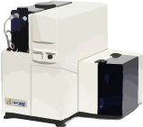
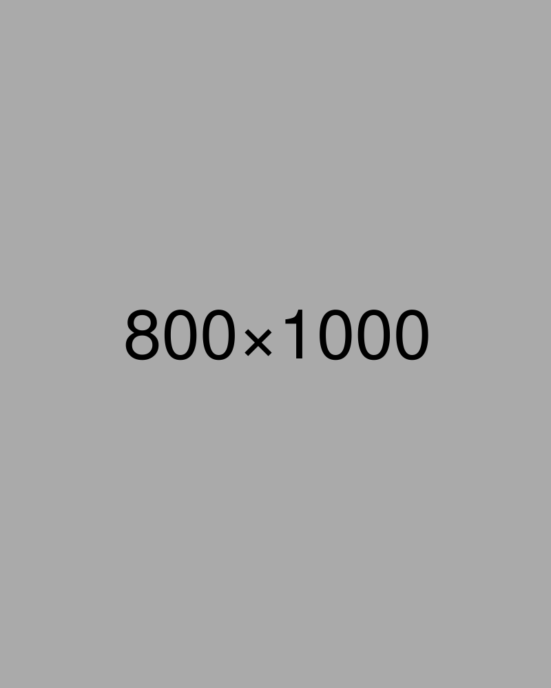

[//]: # (Write a title after #)
# Cardiometabolic laboratory

[//]: # (Write a short description below this)
Lorem ipsum dolor sit amet, consectetur adipiscing elit. Nullam in augue metus. Integer ex erat, auctor ut arcu sed, ornare sollicitudin turpis. Donec metus orci, venenatis a ultrices sed, convallis non sapien. Aliquam tincidunt maximus justo vel accumsan. Ut vel sodales sapien, non efficitur tortor. Aenean scelerisque consectetur nulla. Fusce facilisis accumsan sem, vel aliquam eros tincidunt nec.

Lorem ipsum dolor sit amet, consectetur adipiscing elit. Nullam in augue metus. Integer ex erat, auctor ut arcu sed, ornare sollicitudin turpis. Donec metus orci, venenatis a ultrices sed, convallis non sapien. Aliquam tincidunt maximus justo vel accumsan. Ut vel sodales sapien, non efficitur tortor. 

[//]: # (Do not edit)
 

[//]: # (Do not edit) 
## Technical platform

[//]: # (Write name of apparatus after ###.)
[//]: # (Write location of image after "img scr=". Do not edit align or width.)  
### Flow Cytometry 

[//]: # (Write description of method below this) 
Lorem ipsum dolor sit amet, consectetur adipiscing elit. Nullam in augue metus. Integer ex erat, auctor ut arcu sed, ornare sollicitudin turpis. Donec metus orci, venenatis a ultrices sed, convallis non sapien. Aliquam tincidunt maximus justo vel accumsan. Ut vel sodales sapien, non efficitur tortor. Lorem ipsum dolor sit amet, consectetur adipiscing elit. Nullam in augue metus. Integer ex erat, auctor ut arcu sed, ornare sollicitudin turpis. Donec metus orci, venenatis a ultrices sed, convallis non sapien. Aliquam tincidunt maximus justo vel accumsan. Ut vel sodales sapien, non efficitur tortor. 

[//]: # (Another example)
### ELISA 
Lorem ipsum dolor sit amet, consectetur adipiscing elit. Nullam in augue metus. Integer ex erat, auctor ut arcu sed, ornare sollicitudin turpis. Donec metus orci, venenatis a ultrices sed, convallis non sapien. Aliquam tincidunt maximus justo vel accumsan. Ut vel sodales sapien, non efficitur tortor. Aenean scelerisque consectetur nulla. Fusce facilisis accumsan sem, vel aliquam eros tincidunt nec.Lorem ipsum dolor sit amet, consectetur adipiscing elit. Nullam in augue metus. Integer ex erat, auctor ut arcu sed, ornare sollicitudin turpis. Donec metus orci, venenatis a ultrices sed, convallis non sapien. Aliquam tincidunt maximus justo vel accumsan. Ut vel sodales sapien, non efficitur tortor. 

[//]: # (Do not edit) 
 

[//]: # (Do not edit) 
## Research staff

[//]: # (Write person name after ###.)
[//]: # (Write location of image after "img scr=". Do not edit align or width.)  
### Aase Handberg 

[//]: # (Write title of person after ####) 
#### Professor

[//]: # (Write description of person below this) 
Lorem ipsum dolor sit amet, consectetur adipiscing elit. Nullam in augue metus. Integer ex erat, auctor ut arcu sed, ornare sollicitudin turpis. Donec metus orci, venenatis a ultrices sed, convallis non sapien. Aliquam tincidunt maximus justo vel accumsan.ante mi, vitae eleifend massa posuere sed. Nullam ornare ex vel viverra interdum.

[//]: # (Another example) 
### Anders Askeland 
#### PhD fellow
Lorem ipsum dolor sit amet, consectetur adipiscing elit. Nullam in augue metus. Integer ex erat, auctor ut arcu sed, ornare sollicitudin turpis. Donec metus orci, venenatis a ultrices sed, convallis non sapien. Aliquam tincidunt maximus justo vel accumsan.

[//]: # (Do not edit)
 

[//]: # (Write article name within [] and link within \(\)) 
[//]: # (Use APA reference style.)
## Publications
[Article name](https://www.example.com)

[//]: # (Written example) 
[Askeland A, Borup A, Østergaard O, Olsen JV, Lund SM, Christiansen G, Kristensen SR, Heegaard NHH, Pedersen S. Mass-Spectrometry Based Proteome Comparison of Extracellular Vesicle Isolation Methods: Comparison of ME-kit, Size-Exclusion Chromatography, and High-Speed Centrifugation. Biomedicines. 2020; 8(8):246. https://doi.org/10.3390/biomedicines8080246](https://www.mdpi.com/2227-9059/8/8/246)

## Contact
* Location: Aalborg University Hospital, Denmark
* Email: email@example.com
* Phone: 00 00 00 00
* Webpage: [Cardiometabolic lab Aalborg](www.example.com)